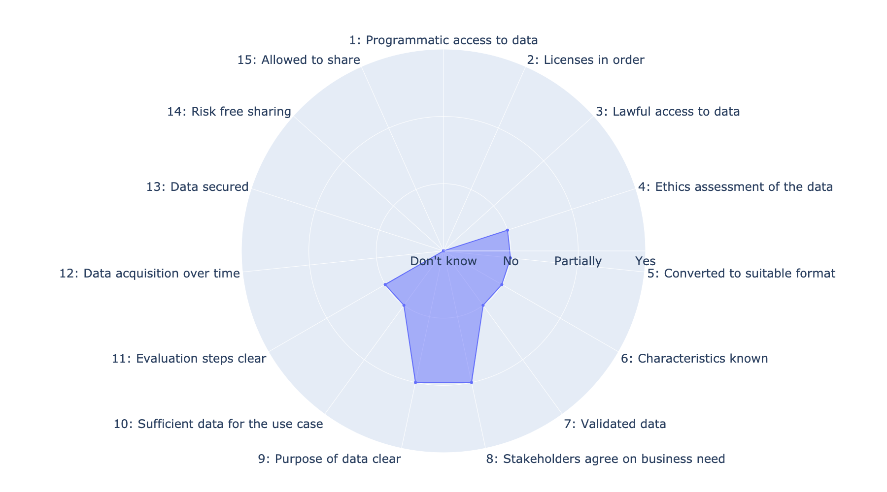
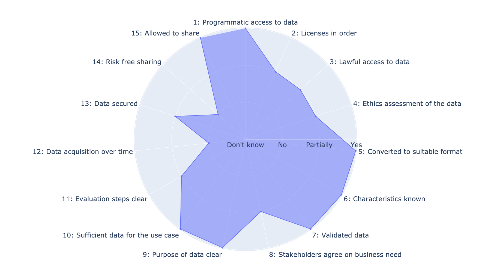
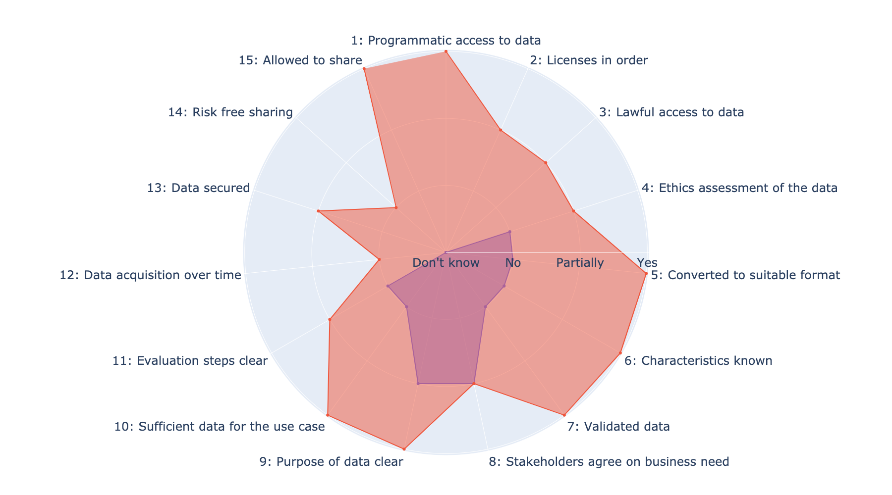

# A tool for visualizing data readiness for NLP

**TL;DR:** This repository contains a description of a method for assessing the data readiness of natural language 
processing (NLP) projects, as well as the code necessary for visualizing the outcome of the method.

## Installation
This program requires you to have python (version > 3.6) and git installed on you computer. Clone this repository and install the `draviz` program by giving the following commands in a terminal:

```bash
git clone https://github.com/fredriko/draviz.git
cd draviz
python setup.py install
```

## Usage

`draviz` is a commandline tool that takes the following arguments:

```txt
usage: draviz [-h] -q QUESTIONS -a ANSWERS [-l {en,sv}] -p PHASES

This program generates radar charts for displaying the answers to questions about data readiness.

optional arguments:
  -h, --help            show this help message and exit
  -q QUESTIONS, --questions QUESTIONS
                        A CSV file containing the questions about data readiness.
  -a ANSWERS, --answers ANSWERS
                        A CSV file containing the answers to the questions about data readiness.
  -l {en,sv}, --language {en,sv}
                        ISO 639-1 code of the language used for marking labelling the axes in the radar chart.
  -p PHASES, --phases PHASES
                        A comma separated list of the phases to include in the radar chart. The phases available depend 
                        on the values in the 'Phases' column of the file answer file specified.
```

See the provided [question](data/questions_en.csv) and [answer](data/dummy_answers.csv) files for examples of how
those file should be structured.

Upon successful completion, `draviz` opens a web browser with the generated radar chart. From the browser, you can 
download the chart on the form of a png file.

### How to reproduce the radar charts

Here's how you reproduce the radar charts shown in the section below (also available in the [images](images/) 
directory).

Type the following in a terminal to generate the [first image](images/drl-assessment-stage-1.png):

```bash
draviz -q data/questions_en.csv -a data/dummy_answers.csv -p "Phase one"
```

The [second image](images/drl-assessment-stage-2.png):

```bash
draviz -q data/questions_en.csv -a data/dummy_answers.csv -p "Phase two"
```

The [comparison image](images/drl-assesment-cmp.png):

```bash
draviz -q data/questions_en.csv -a data/dummy_answers.csv -p "Phase one,Phase two"
```

### Use your own answers

When providing your own answers to the questions on data readiness, you have to alter the three
columns named `Phases`, `Answer`, and `Applicable` in the [answers](data/dummy_answers.csv) file. 

* You can define one or more named phases by adding the corresponding name in the `Phases` column.
* The values in the`Answer` column should be one of the following 0 (**Don't know**), 1 (**No**), 2 (**Partially**), or 
  3 (**Yes**) for the question with the corresponding id in the [questions](data/questions_en.csv) file.
* If one of the questions are not applicable in your case, set the corresponding cell in the `Applicable` column 
  to `False`.

See the description of the assessment method below for more information about the questions.

***

## A method for assessing the Data Readiness of an NLP project

We introduce a method for gaining rapid and rough assessment of the Data Readiness levels of a given NLP project. The 
method is modeled on the notion of Data Readiness Levels introduced by 
[Lawrence, (2017)](https://arxiv.org/abs/1705.02245), and elaborated on in the context of Natural Language
Processing by [Olsson & Sahlgren, (2020)](https://arxiv.org/abs/2009.02043).
The method consists of a range of questions, intended to fuel the discussions between the stakeholders involved in a 
project with respect to its means and goals, as well as a simple way of visualizing the responses to the questions in 
order to bring attention to the areas that need more work.

## Pre-requisites

The pre-requisites for applying the method are the following: there should be a clear business or research-related 
objective for the project to achieve; the objective lends itself to a data-driven solution; and, there is data 
available that presumably is relevant for the task.

The method should be scheduled for application at suitable points in time for the project, i.e., anytime the project 
enters a phase that relies on data and experimentation to make progress in the project plan. We suggest to apply 
the method at the very beginning of the project, as well as (at least) before entering the first round of empirical 
experiments with respect to the data at hand and the project's objective.

## Post-conditions

The outcome of the method is two-fold: a visual representation of the Data Readiness Levels of the project at a 
specific point-in-time; and, the insight into the state of data achieved by venting the questions among the project's 
stakeholders.

## The questions

The purpose of each question is to draw the stakeholders' attention to one aspect of the data readiness of the project. 
However, since not all questions are relevant to all types of projects some may be omitted depending on the 
characteristics of the project at hand.

Each of the fifteen questions below can be answered by one of four options: **Don't know**, **No**, **Partially**, 
and **Yes** (the corresponding numerical values are 0, 1, 2, and 3; see example data further down). **Don't know** 
is always considered the worst possible answer, and **Yes** as the answer to strive for. The admittedly very coarse 
grained answer scale is intended to serve as a guide in assessing the state of the project's data readiness, rather 
than as a definitive and elaborate tool for detailed assessment.

### Questions related to Band C
Band C, that concerns the accessibility of data, is the band in that is the least dependent on the actual objective 
of the project, but clearing it is still required in order to make the project successful.

* **Q1 Do you have programmatic access to the data?** The data should be made accessible to the people who are going to 
  work with it, in a way that makes their work as easy as possible. This usually means programmatic access via an API, 
  database, or spreadsheet.
  
* **Q2 Are your licenses in order?** In the case you plan on using data from a third-party provider, either commercial 
  or via open access, ensure that the licences for the data permit the kind of usage that is needed for the current 
  project. Furthermore, make sure you follow the Terms of Service set out by the provider.
  
* **Q3 Do you have lawful access to the data?** Make sure you involve the appropriate legal competence early on in 
  your project. Matters regarding, e.g., personal identifiable information, and GDPR have to be handled correctly. 
  Failing to do so may result in a project failure, even though all technical aspects of the project are perfectly 
  sound.
  
* **Q4 Has there been an ethics assessment of the data?** In some use cases, such as when dealing with individuals' 
  medical information, the objectives of the project require an ethics assessment. The rules for such a probe into 
  the data are governed by strict rules, and you should consult appropriate legal advisors to make sure your project 
  adheres to them.
  
* **Q5 Is the data converted to an appropriate format?** Apart from being accessible programmatically, and assessed 
  with respect to licenses, laws, and ethics, the data should also be converted to a format appropriate for the 
  potential technical solutions to the problem at hand. One particular challenge we have encountered numerous times, 
  is that the data is on the format of PDF files. PDF is an excellent output format for rendering contents on screen 
  or in print, but it is a terrible input format for data-driven automated processes (see, e.g., 
  [Panait, (2020)](https://filingdb.com/b/pdf-text-extraction) for examples).
    

### Questions related to Band B
Band B concerns the validity of data. In pursuing projects with external parties, we have so far seen fairly few issues 
having to do with the validity of data. In essence, Band B is about trusting that the data format is what you expect 
it to be.

* **Q6 Are the characteristics of the data known?** Are the typical traits and features of the data known? Perform an 
  exploratory data analysis, and run it by all stakeholders in the project. Make sure to exemplify typical and extreme 
  values in the data, and encourage the project participants to manually look into the data.
    
* **Q7 Is the data validated?** Ensure that the traits and features of the data make sense, and, e.g., records are 
  deduplicated, noise is catered for, and that null values are taken care of.
    
### Questions related to Band A

Band A concerns the utility of data. As such, it is tightly coupled to the objective of the project. In our experience, 
this is the most elusive data readiness level in that it requires attention every time the goal of a project changes.

* **Q8 Do stakeholders agree on the objective of the current use case?** What problem are you trying to solve? The 
  problem formulation should be intimately tied to a tangible business value or research hypothesis. When specifying 
  the problem, make sure to focus on the actual need instead of a potentially interesting technology. The 
  characteristics of the problem dictates the requirements on the data. Thus, the specification is crucial for 
  understanding the requirements on the data in terms of, e.g., training data, and the need for manual labelling of 
  evaluation or validation data. Only when you know the characteristics of the data, it will be possible to come up 
  with a candidate technological approach to solve the problem.

* **Q9 Is the purpose of using the data clear to all stakeholders?** Ensure that all people involved in the project 
  understands the role and importance of the data to be used. This is to solidify the efforts made by the people 
  responsible for relevant data sources to produce data that is appropriate for the project's objective _and_ the 
  potential technical solution to address the objective.

* **Q10 Is the data sufficient for the current use case?** Given the insight into what data is available, consider 
  the questions: What data is needed to solve the problem? Is that a subset of the data that is already available? 
  If not: is there a way of getting all the data needed? If there is a discrepancy between the data available, and the 
  data required to solve the problem, that discrepancy has to be mitigated. If it is not possible to align the data 
  available with what is needed, then this is a cue to go back to the drawing board and either iterate on the problem 
  specification, or collect suitable data. 

* **Q11 Are the steps required to evaluate a potential solution clear?** How do you know if you have succeeded? The 
  type of data required to evaluate a solution is often tightly connected to the way the solution is implemented: if 
  the solution is based on supervised machine learning, i.e., requiring labelled examples, then the evaluation of the 
  solution will also require labelled data. If the solution depends on labelled training data, the process of 
  annotation usually also results in the appropriate evaluation data. Any annotation effort should take into account 
  the quality of the annotations, e.g., the inter-annotator agreement; temporal aspects of the data characteristics,
  e.g., information on when we need to obtain newly annotated data to mitigate model drift; and, the representativity 
  of the data. 
  [Tseng et al., (2020)](https://www.researchgate.net/publication/344343972_Best_Practices_for_Managing_Data_Annotation_Projects?channel=doi&linkId=5f6a441aa6fdcc0086345843&showFulltext=true) 
  provide a comprehensive set of best-practices for managing annotation projects.

* **Q12 Is your organization prepared to handle more data like this beyond the scope of the project?** Even if the data 
  processing in your organization is not perfect with respect to the requirements of machine learning, each project 
  you pursue has the opportunity to articulate improvements to your organization's data storage processes. Ask 
  yourself the questions: How does my organization store incoming data? Is that process a good fit for automatic 
  processing of the data in the context of an NLP project, that is, is the data stored on a format that brings it 
  beyond Band C (**accessibility**) of the Data Readiness Levels? If not; what changes would need to be made to 
  make the storage better?

* **Q13 Is the data secured?** Ensure that the data used in the project is secured in such a way that it is only 
  accessible to the right people, and thus not accessible by unauthorized users. Depending on the sensitivity of the 
  project, and thus the data, there might be a need to classify the data according to the security standards of your 
  organization (e.g., ISO 27001), and implement the appropriate mechanisms to protect the data and project outcome. 
    
* **Q14 Is it safe to share the data with others?** In case the project aims to share its data with others, the risks 
  of leaking sensitive data about, e.g., your organization's business plans or abilities have to be addressed prior 
  to sharing it.
    
* **Q15 Are you allowed to share the data with others?** In case the project wishes to share its data, make sure you 
  are allowed to do so according to the licenses, laws, and ethics previously addressed in the project.


## Example application of the method

For the purpose of exemplifying the use of the method described above, consider the fictitious case of project 
_Project_, an undertaking of a large organization with good experience of running conventional ICT projects, but 
little knowledge about data-driven NLP-based analysis. The actual subject matter and scope of _Project_ is not 
important.

### First application of the method

When the project is initiated, the project manager involves its members in a session in which they recognize all 
fifteen questions as relevant for the project's objectives, then discusses each question, and agrees on the appropriate 
answer. When the session is over, the project manager plots the responses in a radar chart, as displayed in Figure 1, 
in such a way that each of the questions answered is present in the chart, starting with Q1 
(**Programmatic access to data**) up north, then progressing clock-wise with each question. The responses are plotted 
such that **Don't know** (the worst answer) is located at the center of the chart, while **Yes** (the best answer) 
is closest to the chart's edge. The aim of the assessment method is for the surface constituted by the enclosed 
responses to cover as large an area as possible. The reasons are simple; first, all stakeholders, in particular those 
in executive positions, will gain immediate visual insight into the state of the data for the project and, hopefully, 
feel the urge to act to increase the area; second, it is easy to visualize the project's progress at discrete points 
in time by overlaying two (or more) radar charts.


**Figure 1:** The figure illustrates the state of data readiness at the beginning of the fictitious project.


From Figure 1, it can be seen that _Project_, at its incarnation, is not very mature with respect to data readiness. 
The area covered by the enclosed responses is small, and the number of unknowns are large. The only certainties 
resulting by the initial assessment of _Project_, are that: there has been no ethical assessment made of the data; 
the data has not been converted to a suitable format; no characteristics of the data are known; the data has not been 
validated; there is not sufficient data for the use case; and the way to evaluate the success of the project has yet 
to be defined. On the bright side, the stakeholder partially agrees on the objective of the project, and the purpose 
of the data.

### Second application of the method

Fast forward to the second data readiness assessment of _Project_. In this case, it is scheduled to take place prior 
to the project embarking on the first rounds of empirical investigations of the state of data in relation to the 
project's business objective. The purpose of looking into the data readiness of the project at this stage, 
is to support the project manager in their work regarding prioritization, management of resources, and handling of 
expectations in relation to the project's progression and ability to reach its goals. 


**Figure 2:** The figure shows the corresponding state at the time where the project is ready to start making 
experiments based on the data.

Again, after all stakeholders have agreed on responses to the questions of the method, they are plotted in a radar 
chart. Figure 2 shows the state of the project after the second data readiness assessment. Progress has been made;
the area covered by the responses is larger than it was at the initial assessment (Figure 1). There are no unknowns 
left among the responses. Data is available and converted to a suitable format, its characteristics are known and the 
data format is generally trusted within the project. The fact that licenses, legal aspects of access, and ethics are 
not quite there yet does not, technically speaking, prohibit the project from moving on with the empirical 
investigation. However, these issues should be properly addressed before the project results are deployed to a 
general audience.

The stakeholders are still not in full agreement on the project's business objective, but they are aware of the 
purpose of the data, which has been deemed sufficient for the use case. Given the uncertainty with respect to 
the business objective, the steps required to evaluate proposed solutions are also unclear.

Beyond the scope of the project, the organization is not yet set up to in a way that is required to repeat and 
reproduce the findings of _Project_ to future data, and data security is still work in progress. The project is 
allowed to share the data if it wishes to to so, but since management has decided to play it safe with respect 
to giving away too much information regarding the organization's future plans in doing so, it has been decided 
that data should not be share with external parties.


**Figure 3:** The figure shows a comparison of the contents of Figure 1 and Figure 2 in the same
radar chart.

## Contribute

We'd be happy to take feedback on the method itself, as well as contributions to the code. Get in touch at
`fredrik.olsson AT gmail.com` or submit an issue or pull request to this repository.


