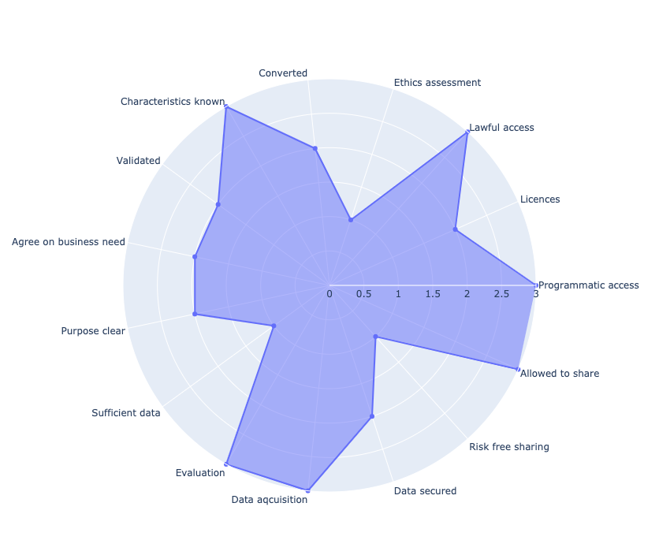
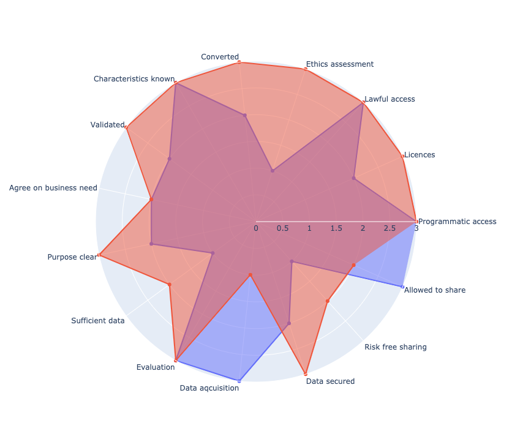
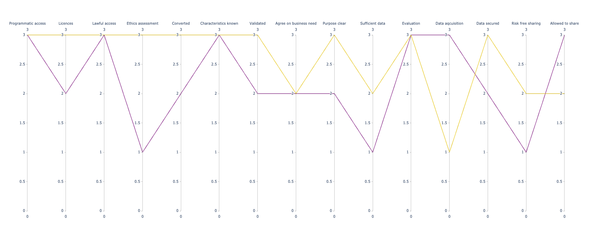

# Visualizations of Data Readiness

Visualization methods for the responses provided to the questions used to assess the data readiness of applied
machine learning projects. The method is modeled on the notion of Data Readiness Levels introduced by 
([Lawrence, (2017)](https://arxiv.org/abs/1705.02245), and elaborated on in the context of Natural Language
Processing by [Olsson & Sahlgren, (2020)](https://arxiv.org/abs/2009.02043))

## Method

## Questions

The following questions are used for illustrative purposes. All questions should be answered by a number such as
(0) Don't know, (1) No, (2) Partially, (3) Yes.

1. Band C - Do you have programmatic access to the data?
1. Band C - Do you have the licences required to use the data?
1. Band C - Have you ensured that you have lawful access to the data, e.g., GDPR?
1. Band C - Have you carried out an ethics assessment of your use of the data?
1. Band C - Is the data encoded and converted and to an appropriate machine readable format?
1. Band B - Are you familiar with the characteristics of the data i.e., by means of, e.g., an exploratory analysis?
1. Band B - Has the data been validated, e.g., duplicates removed, nulls handled?
1. Band A - Are all stakeholders agreeing on the business need to be addressed by means of the data?
1. Band A - Is the purpose of the data clear to all stakeholders?
1. Band A - Is the data sufficient in addressing the business need at hand?
1. Band A - Do you have sufficient means to evaluate potential solutions to your business need?
1. Band A - Is your data acquisition process able to handle new data?
1. Band A - Is you data secured (wrt to breaches, and business risks)?
1. Band A - Is it free of risk for you to share your refined data with others (wrt business)?
1. Band A - Are you allowed to share your refined data wrt to, e.g., licensing, PII etc?

### Mock data

The file [data.csv](data/data.csv) contains made-up answers for two fake companies, to be used for the example 
visualizations.

## Visualizations

### resources

* Spider graph (aka radar chart)
  - https://plotly.com/python/radar-chart
  - https://www.python-graph-gallery.com/radar-chart/
  - https://www.data-to-viz.com/caveat/spider.html (**READ THIS**)
* Parallel coordinate plot
  - https://www.python-graph-gallery.com/parallel-plot/
  - https://plotly.com/python/parallel-coordinates-plot/
    
### Examples
Below are example radar charts generated from the mock data using [src/charts.py](src/charts.py). The first graph 
shows the answers for a single company, while the second graph fits two companies in the same graph.

Here is an example of a parallel plot based on the same data

## TODO

* Bring parallel coordinate plots up to speed with the radar charts.
